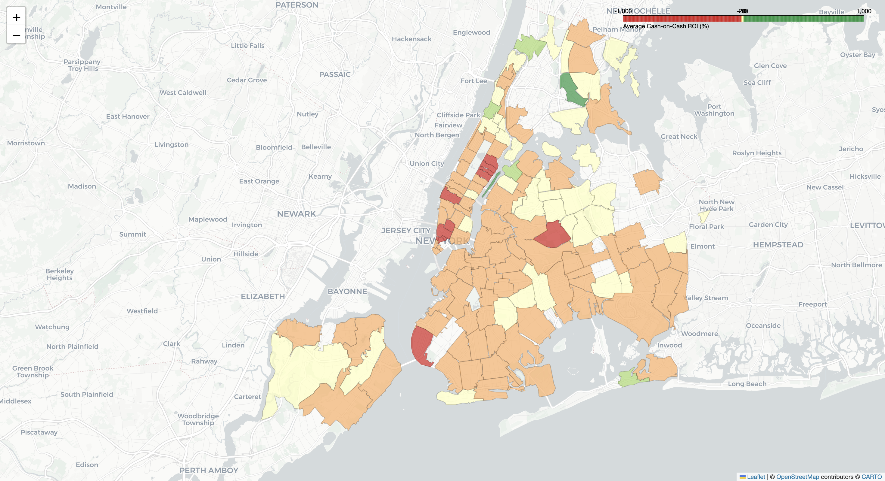

#  The Short-Term Rental Arbitrage Engine
### *Optimizing Real Estate Investment Strategy using Geospatial Data Fusion & Machine Learning*

##  Executive Summary
Real estate investors often rely on intuition or fragmented data, knowing the purchase price (Zillow) but lacking accurate insight into potential short-term rental revenue (Airbnb).

**The Solution:** I built an end-to-end analytical engine that ingests housing market data, predicts potential rental yields using **XGBoost**, and identifies "Arbitrage Opportunities"—neighborhoods with low purchase costs but high rental demand.

**Key Findings:**
* **Market Efficiency:** The average Cash-on-Cash ROI for a generic Airbnb in NYC is **-14.16%**, confirming that the market is highly saturated and efficient. Most properties will lose money if managed passively.
* **The Opportunity:** Despite the negative average, the model identified specific micro-markets (Zip Codes) where the ROI remains positive, specifically in areas where the "Distance to Subway" penalty is lower than the drop in property cost.
* **Model Performance:** The Price Prediction Model achieved an **R² Score of 0.51**, successfully capturing over half of the price variance using only public data features.

---

##  Technical Architecture
This project implements a production-grade data pipeline:

1.  **ETL & Data Fusion:**
    * Ingested **11,000+** Airbnb listings and Zillow Home Value Index (ZHVI) data.
    * **Geospatial Engineering:** Used `Geopandas` to perform a **Spatial Join**, mapping raw GPS coordinates from Airbnb to official NYC Zip Code Tabulation Areas (ZCTAs) to link revenue potential with acquisition cost.
2.  **Machine Learning (Price Prediction):**
    * Built an **XGBoost Regressor** to predict the "Fair Market Nightly Rate" based on room count, amenities, and location.
    * **Optimization:** Tuned for categorical handling of Zip Codes to capture neighborhood-specific premiums.
3.  **Financial Analytics:**
    * Engineered a custom **ROI Calculator** accounting for Mortgage Principal & Interest (6.5% rate), Taxes, Maintenance, and Vacancy rates.

---

## Interactive Dashboard
*Below is the ROI Heatmap. Green areas represent positive cash flow opportunities; Red areas represent capital sinks.*


*(Note: View the interactive `nyc_roi_map.html` file in the repo for tooltips and details)*

---

## Methodology: How It Works

### Phase 1: The "Spatial Join" (Data Engineering)
Airbnb provides data points (Lat/Lon). Zillow provides data by Region (Zip Code). To merge them, I used a standard Point-in-Polygon geometric operation:

```python
# Mapping 11k points to polygon shapes
gdf_joined = gpd.sjoin(gdf_airbnb, gdf_nyc, how="inner", predicate="within")
```

### Phase 2: The "Arbitrage" Logic (Business Analysis)
I moved beyond simple "Gross Revenue" to calculate **Cash-on-Cash ROI**, the metric sophisticated investors actually use:

$$ ROI = \frac{\text{Annual Cash Flow}}{\text{Total Cash Invested (Down Payment + Closing Costs)}} $$

### Phase 3: Model Interpretability (Data Science)
Using **SHAP (SHapley Additive exPlanations)**, I visualized exactly *why* the model predicts certain prices.


**Insight:**
* **Accommodates (Capacity):** As expected, this is the strongest predictor of price.
* **Distance to Subway:** The long "tail" to the left indicates that being very far from a subway station significantly penalizes the rental price, often more than the reduction in home value, destroying ROI.

---

## 💻 How to Run This Project

**1. Clone the Repo**
```bash
git clone https://github.com/ayush-274/rental-arbitrage-engine.git
cd rental-arbitrage-engine
```

**2. Set Up Virtual Environment**
```bash
python -m venv venv
source venv/bin/activate  # On Windows: venv\Scripts\activate
pip install -r requirements.txt
```

**3. Run the Notebooks**
* `notebooks/1_Data_Engineering.ipynb`: Cleans data and performs the spatial merge.
* `notebooks/2_Modeling_and_ROI.ipynb`: Trains the XGBoost model, calculates financial metrics, and generates SHAP plots.
* `notebooks/3_Visualization_and_Reporting.ipynb`: Generates the interactive Folium map.

---

## 📂 Repository Structure
```text
├── data/
│   ├── raw/ (Airbnb listings, Zillow CSV, NYC Shapefiles - ignored by git)
│   └── processed/ (The fused Master Dataset)
├── images/
│   ├── map_screenshot.png
│   └── shap_summary.png
├── notebooks/
│   ├── 1_Data_Engineering.ipynb
│   ├── 2_Modeling_and_ROI.ipynb
│   └── 3_Visualization_and_Reporting.ipynb
├── requirements.txt
└── README.md
```